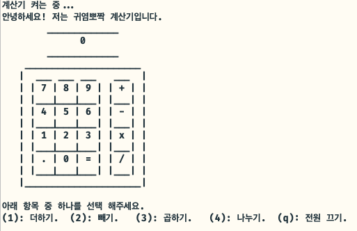

# Bright Tomorrow Camp

## Swift Basic

### Calculator

- 산술 연산자를 통해 연산 수행 `Calculator` 클래스 생성
- `AddOperation`, `SubtractOperation`, `MultipleOperation`, `DivideOperation` 메소드 구성
- `usleep`메소드를 통한 fake loading 메소드 구성
- 프로토콜을 활용한 클래스 추상화 작업 및 CUI 구성

- [프로젝트 바로가기](./Calculator)

## Swift Deep
