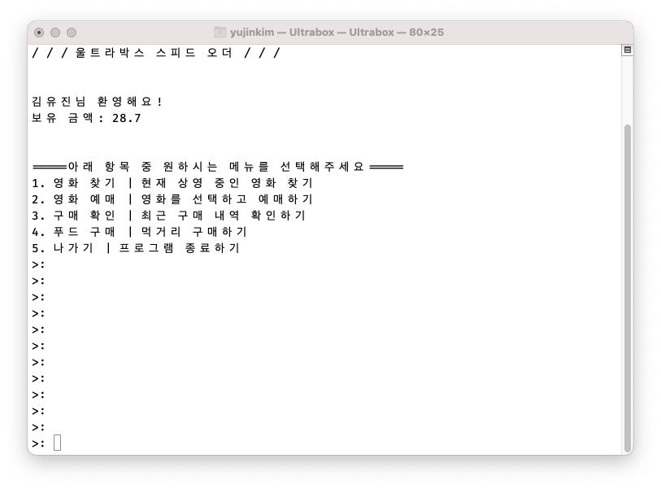

# Bright Tomorrow Camp

## Swift Basic

### Calculator


- 산술 연산자를 통해 연산 수행 `Calculator` 클래스 생성
- `AddOperation`, `SubtractOperation`, `MultipleOperation`, `DivideOperation` 메소드 구성
- `usleep`메소드를 통한 fake loading 메소드 구성
- 프로토콜을 활용한 클래스 추상화 작업 및 CUI 구성
- [프로젝트 바로가기](./Calculator)

## Swift Deep

### Ultrabox



- 단계별 맞춤형 기능 적용 연습(Lv.0 ~ Lv.5)
- 기능에 따른 구조체 분리와 메소드 선언
- 코드의 유지 보수를 고려해 정적인 문자열을 하나의 구조체로 유연하게 관리
- 프로젝트 파일 구조

  ```bash
  .
  ├── Interface
  │   ├── Launcher.swift
  │   ├── Layout.swift
  │   └── Manual.swift
  ├── Model
  │   ├── Menu.swift
  │   ├── Movie.swift
  │   ├── Snack.swift
  │   └── User.swift
  ├── Service
  │   └── Deposit.swift
  └── main.swift
  ```

- [프로젝트 바로가기](./Ultrabox)
