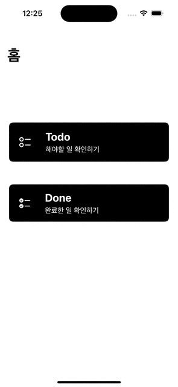

# Bright Tomorrow Camp

## Swift Basic

### Calculator


- 산술 연산자를 통해 연산 수행 `Calculator` 클래스 생성
- `AddOperation`, `SubtractOperation`, `MultipleOperation`, `DivideOperation` 메소드 구성
- `usleep`메소드를 통한 fake loading 메소드 구성
- 프로토콜을 활용한 클래스 추상화 작업 및 CUI 구성
- [프로젝트 바로가기](./Calculator)

## Swift Deep

### Ultrabox


- 단계별 맞춤형 기능 적용 연습(Lv.0 ~ Lv.5)
- 기능에 따른 구조체 분리와 메소드 선언
- 코드의 유지 보수를 고려해 정적인 문자열을 하나의 구조체로 유연하게 관리
- 프로젝트 파일 구조

  ```bash
  .
  ├── Interface
  │   ├── Launcher.swift
  │   ├── Layout.swift
  │   └── Manual.swift
  ├── Model
  │   ├── Menu.swift
  │   ├── Movie.swift
  │   ├── Snack.swift
  │   └── User.swift
  ├── Service
  │   └── Deposit.swift
  └── main.swift
  ```

- [프로젝트 바로가기](./Ultrabox)

### MyTodo

<p align="center">
	
	
</p>

- 스토리보드와 인터페이스 빌더를 사용해 기본 UI View 구성
- `UIView`, `UIViewController`를 활용한 VC 패턴 적용
- 하나의 인스턴스로 모델 데이터를 관리하기 위해 싱글톤 패턴의`DataManager`구조체 구성
- `UITableCell`, `UITableViewDelegate`, `UITableViewDataSource`를 활용한 테이블 뷰와 셀 데이터 관리
- 프로젝트 구조

  ```bash
  ├── MyTodo
  │   ├── Application
  │   │   ├── AppDelegate.swift
  │   │   └── SceneDelegate.swift
  │   ├── Info.plist
  │   ├── Model
  │   │   ├── Done.swift
  │   │   └── Todo.swift
  │   ├── Presentation
  │   │   ├── DoneList
  │   │   │   ├── StoryBoard
  │   │   │   │   └── DoneList.storyboard
  │   │   │   └── ViewController
  │   │   │       └── DoneListViewController.swift
  │   │   ├── Home
  │   │   │   ├── StoryBoard
  │   │   │   │   └── Home.storyboard
  │   │   │   └── ViewController
  │   │   │       └── HomeViewController.swift
  │   │   └── TodoList
  │   │       ├── StoryBoard
  │   │       │   └── TodoList.storyboard
  │   │       └── ViewController
  │   │           └── TodoListViewController.swift
  │   ├── Resource
  │   │   ├── Assets.xcassets
  │   │   │   ├── AccentColor.colorset
  │   │   │   │   └── Contents.json
  │   │   │   ├── AppIcon.appiconset
  │   │   │   │   └── Contents.json
  │   │   │   └── Contents.json
  │   │   └── LaunchScreen.storyboard
  │   └── Utility
  │       ├── DataManager.swift
  │       └── DatePrinter.swift
  ├── MyTodo.xcodeproj
  ├── MyTodo.xctestplan
  ├── MyTodoTests
  │   ├── DatePrinterTest.swift
  │   └── MyTodoTests.swift
  └── MyTodoUITests
      ├── MyTodoUITests.swift
      └── MyTodoUITestsLaunchTests.swift
  ```

- [프로젝트 바로가기](./MyTodo)

### MyTodo

- [프로젝트 바로가기](./Sonamu)
