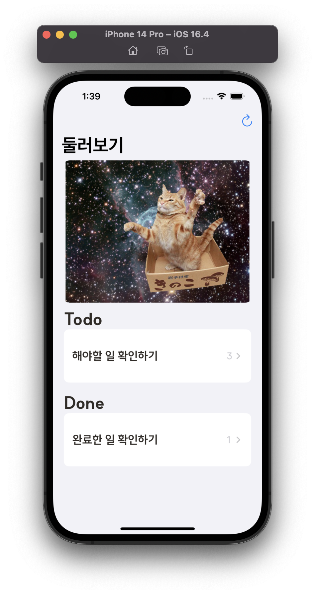
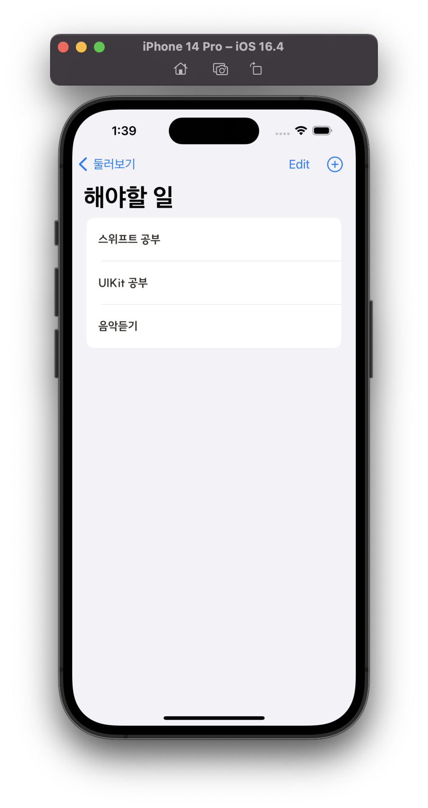
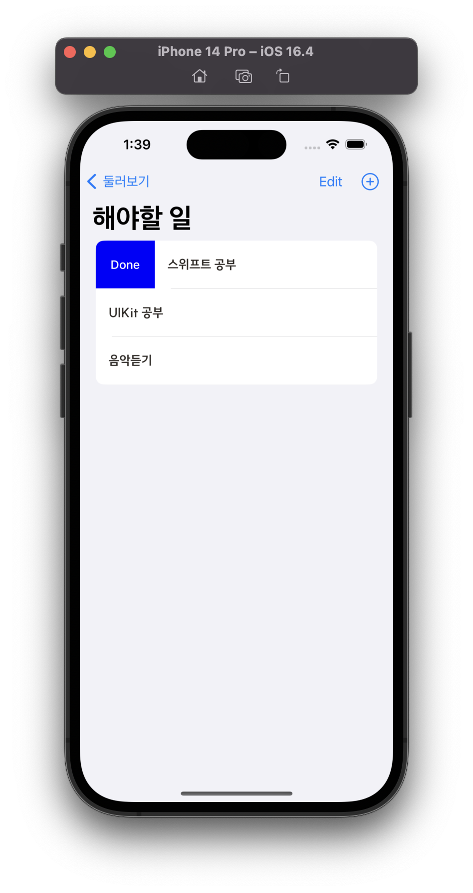
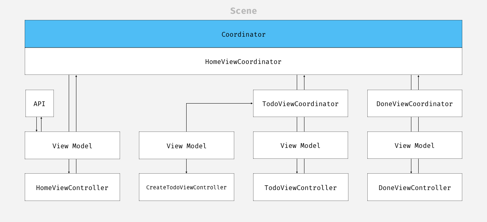

# Sonamu

- So(그래서), 나 무엇을 해야하지? 애플리케이션 **Sonamu**는 [스파르타코딩클럽 내일배움캠프](https://spartacodingclub.kr/)의 앱개발 숙련 과제입니다.
- 학습한 내용을 적용시키고 추가적으로 Apple에서 제공하는 여러 기본 기능을 적용하고 숙지하는 것이 목표입니다.

	
	
  

## 구현

- [x] Coordinator + MVVM Pattern 학습 및 적용
- [x] `UserDefaults`를 사용해서 데이터 일관성 유지
- [x] `Lazy Initialization`형태로 UI 컴포넌트 적용
- [x] `UITableView` Section / Header 활용
- [x] `URLSession`을 활용한 이미지 데이터 `UIImageView` 사용
- [x] `UISwipeActionsConfiguration`으로 `LeadingSwipeAction` 적용

## Application Layer

### About Coordinator Pattern

- 기존 화면 전환은 이전 `UIViewController`가 다음`UIViewController`가 무엇인지 알고 있어야 하는 구조이다.
- `UIViewController`의 결합도를 증가시킬 수 밖에 없는 구조이다.

> 실제로 Instruments의 Leaks를 통해 Persistant 수치가 가끔 누적되는 현상을 목격할 수 있다.

- 심한 커플링 현상은 Memory Leak 현상이 발생할 수 있기 때문에 애플리케이션 규모가 커질수록 테스트도 힘들어진다.
- 코디네이터 패턴은 이러한 문제를 방지할 수 있다.
- 모든 `UIViewController`는 `Coordinator`인스턴스만 보유한다.
- 모든 `UIViewController`는 자신을 제외하고 다른 `UIViewController`인스턴스를 보유하지 않는다.
- 화면 전환과 관련된 기능은 무조건 `Coordinator`에게 요청하고 결과를 `UIViewController`에게 전달하는 방식으로 동작하게 한다.
